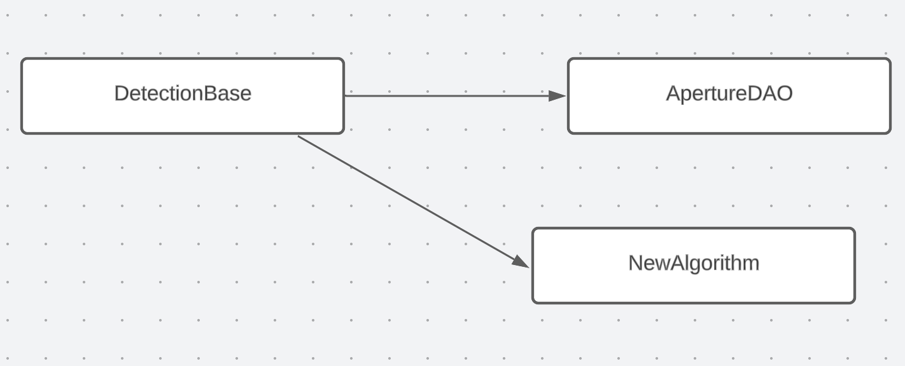

# fitsviz
fitsviz is a Python package that provides functionality for visualizing and analyzing FITS (Flexible Image Transport System) files. It includes two main commands: `mkstat` and `mkviz`. 


## Installation

To install fitsviz, you can use pip and the provided `pyproject.toml` file:

`pip install fitsviz`


## Usage

### mkstat Command
```
Usage: python -m fitsviz mkstat [OPTIONS]

  Given an input directory, detect sources from the science image at the
  lowest frequency  and write 3 files.

  1) link.json: file used to link statistics files for further visualizations

  2) flux_freq.csv: source and file wise flux measurements for detected
  sources

  3) sources.csv: Contains source position, flux and spectral index
  measurements

Options:
  -i PATH                      Directory containig all science and RMS images,
                               Defaults to pwd  [required]
  -od PATH                     OPTIONAL, Defaults to pwd
  -o, --output_file_name TEXT  OPTIONAL,defaults to sources.csv
  -a, --algorithm [aperture]   OPTIONAL, source detection algorithm, Defaults
                               to aperture

```
`mkstat` writes 3 files which are used by `mkviz`

### mkviz Command
```

visualize the lowest frequency science image in a directory

Options:
  -i PATH                         path to link.json  [required]
  -vt, --vis_type [raw|grid|fvf]  raw = Large science image with highlighted
                                  sources ,grid = show interactive gridded
                                  plot of sources,  fvf = plot flux vs
                                  frequency of all sources  [required]
  -od PATH                        OPTIONAL, Output directory ,Defaults to pwd
  -b, --backend [bokeh]           OPTIONAL: Visualization backend, Defaults to
                                  Bokeh
  --help                          Show this message and exit.
```


Example usage:

fitsviz mkviz -i path/to/science_images -b matplotlib


## Dependencies

The fitsviz package depends on the following libraries and versions:


- 'poetry-core',
- 'bokeh>=3.2.0',
- 'click>=8.1.5',
- 'dask>=2023.5.0',
- 'matplotlib>=3.7.2',
- 'numpy>=1.20.1',
- 'pandas>=2.0.3',
- 'scipy>=1.11.1',
- 'photutils>=1.8.0',
- 'dask[distributed]>=2023.7.0'

Please ensure that these dependencies are installed in your Python environment.

## Build Information

The package uses the "setuptools" build backend, as specified in the `pyproject.toml` file.


## A Note on performance
Dask arrays and dask distributed are used in vectorized forms to enable 
parallelization in the ApertureDAO class

### Developer information
Please install this package in edit mode with

`pip install -e .`

The package is structured as follows:

utils/cutils - common utils such as file loading, file parsing etc
viz - visualization plots with custom backends
test - unit tests with pytest
detection - detection algorithms

# Developing new Algorithms
DetectionBase is the abstract base class for star finders.
All source detection algorithms should have DetectionBase as the base class
and implement  `get_sources` ,`get_fluxs` and `get_summary`



The only supported algorithm right now is DAOStarFinder with a crude approximation of aperture photometry

All visualization programs should exist in viz and should not call DetectionBase

This is to separate the visualizations from the heavy computations involved in source detection
and to ensure link.json is used.


